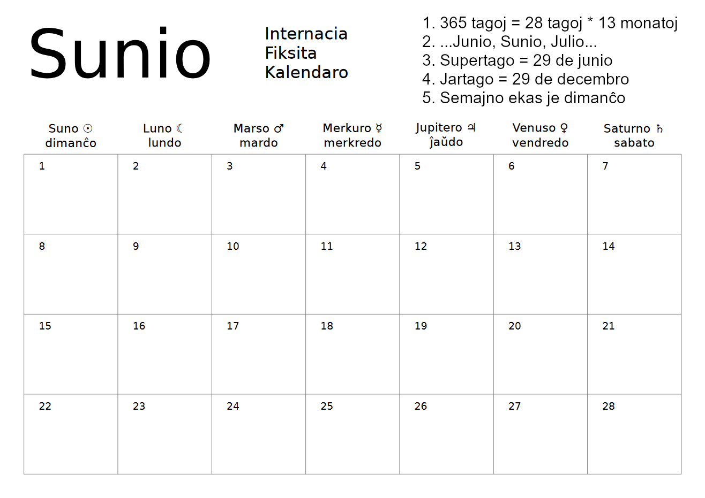

# Internacia Fiksita Kalendaro
## Alternative calendar website in Esperanto
### https://kalendaro.xyz



## Set up website
```shell
./setup.sh
```

You will need to mention:
1) Webhost
2) Email (for certificate)

The script is intended to be executed by root in /root/kalendaro

## Set up crontab
```shell
apt update
apt install cron -y
crontab -e
"*/5 * * * * /usr/local/bin/datilo"
"0 * * * * /usr/local/bin/purigilo"
"0 0 1 * * certbot renew"
```

## Roadmap
* Translate timezones into Esperanto (./website/js/tz.js -> var TimeZones)
* Translate to different artifical languages (add mirrors)

## What is it?
https://www.youtube.com/watch?v=ZWpVQz-Ei30
